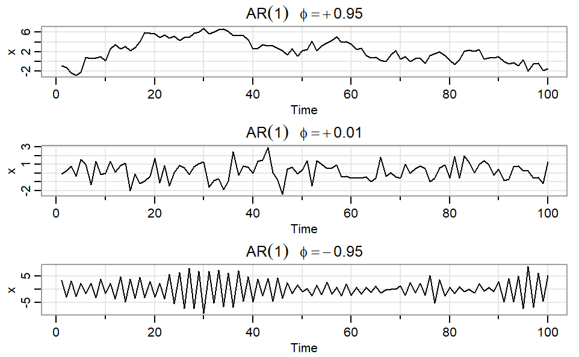
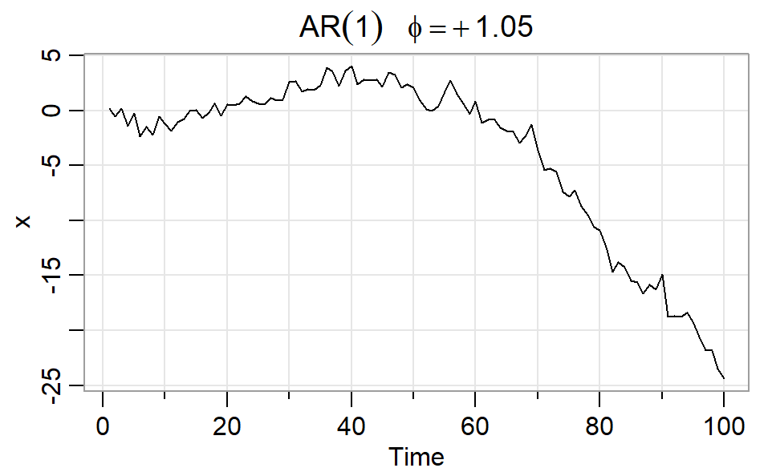

```{r, echo=FALSE}
library(forecast)
library(fpp3)
library(tidyverse)
library(tsbox)
library(zoo)
library(seasonal)
library(astsa)
```

```{r setup, include=FALSE}
source("setup.R")
library(patchwork)
```

## ARIMA Model

Autoregressive Integrated Moving Average (ARIMA) models are the most popular parametric models for time series that directly model the autocorrelation structure of the time series based on different values of the parameters in the model

The models are usually abbreviated as ARIMA(p,d,q) where $\mathbf{p}$ stands for the order of the **autoregressive part**, $\mathbf{q}$ stands for the order of **moving average** part and $\mathbf{d}$ stands for the order of integration (**differencing**)

Given a time series $Y_t$, the model provides a mechanistic evolution equation for $Y_t$ over time. For an ARIMA($p, d, q$) process, the quatitiy that is modeled as a staitonary time series is the $d$th order difference of the process, i.e. $X_t = Y_t - Y_{t-d}$

It is assumed that the differenced process $X_t$ then follows an ARMA($p, q$) process who evolution over time is described by a mathematical equation involving the process history up to $p$ previous observations $X_{t-1}, \ldots, X_{t-p}$ and the values of driving noise sequence for the current period and up to $q$ prior time periods $\epsilon_t, \ldots, \epsilon{t-q}$. The equation is written as $$ X_t = \phi_1 X_{t-1} + \cdots + \phi_p X_{t-p} + \epsilon_t + \theta_1 \epsilon_{t-1} + \cdots + \theta_q \epsilon_{t-q} $$ where $\phi_1, \ldots, \phi_p, \theta_1, \ldots, \theta_q$ are some unknown parameters of the model. There is one more paramter, that is the variance of the noise process, $Var(\epsilon_t) = \sigma^2.$

## ARIMA Model Exercises

First, we learn things for ARMA($p, q$), later we will introduce the integration part to have ARIMA($p,d,q$) models

Pretending that our sample $X_1, \ldots, X_T$ has been generated by an ARMA the following are common tasks that we need to learn to perform:

-   **Model specification:** Figure out the orders $p$ and $q$ either by exploratory analysis or in a more objective analytical manner.

-   **Estimation:** Given $p$ and $q$, and the sample, how to estimate the unknown parameters $\phi_1, \ldots, \phi_p, \theta_1, \ldots, \theta_q, \sigma^2$?

-   **Prediction:** What are the prediction equations for an ARMA model with given parameter values if we want to predict $h$-step ahead in the future: i.e., given $X_1, \ldots, X_T$ we want to forecast $X_{T+h}$?

-   **Prediction Interval:** If we apply the prediction equation at the estimated parameter values, how do we quantify the uncertainty of the forecasts?

## \## Basic concepts and notation

To perform all the tasks it is helpful to understand some basic concepts and notation. Then we begin by understanding the model using simpler submodels (only AR, only MA, etc and learn how to do basic exploratory analysis.

-   Stationarity: \[paraphrasing FPP\] A stationary time series is one whose statistical properties do not depend on the time window at which the series is observed. but rather on the width of the window. Series with patterns such as trends, or seasonal patterns are not stationary — the trend and seasonality will affect the value of the time series at different times. On the other hand, a **white noise** series is stationary — a **white noise series** is the prototypical error sequence consisting of a sequence of uncorrelated mean zero constant variance random variables that over time generates a random up and down fluctuation pattern within a band around zero

    Some cases can be confusing — a time series with cyclic behavior (but with no trend or seasonality) is stationary. This is because the cycles are not of a fixed length, and hence behavior at a given time point is not predictable.

    In general, a stationary time series will have no predictable patterns in the long term. Time plots will show the series to be roughly horizontal (although some cyclic behavior is possible), with constant variance.

## Stationarity

If $\{y_t\}$ is a **stationary time series**, then for all $s$, the distribution of $(y_t,\dots,y_{t+s})$ does not depend on $t$.

A stationary series is:

-   roughly horizontal
-   constant variance
-   no patterns predictable in the long term

## Stationary or not

```{r stationary, echo=FALSE, warning=FALSE, fig.height=4.6, fig.width=10}
p1 <- gafa_stock |>
  filter(Symbol == "GOOG", year(Date) == 2015) |>
  autoplot(Close) +
  labs(subtitle = "(a) Google closing price", x = "Day", y = " $US")

p2 <- gafa_stock |>
  filter(Symbol == "GOOG", year(Date) == 2015) |>
  autoplot(difference(Close)) +
  labs(subtitle = "(b) Change in google price", x = "Day", y = "$US")

p3 <- as_tsibble(fma::strikes) |>
  autoplot(value) +
  labs(subtitle = "(c) Strikes: US",
       y = "Number of strikes",
       x = "Year")

p4 <- as_tsibble(fma::hsales) |>
  autoplot(value) +
  labs(subtitle = "(d) House sales: US",
       y = "Number of houses",
       x = "Month")

p5 <- as_tsibble(fma::eggs) |>
  autoplot(value) +
  labs(subtitle = "(e) Egg prices: US",
       y = "$US (constant prices)",
       x = "Year")

p6 <- aus_livestock |>
  filter(State == "Victoria", Animal == "Pigs") |>
  autoplot(Count) +
  labs(subtitle = "(f) Pigs slaughtered: Victoria, Australia",
       y = "Number of pigs",
       x="Month")

p7 <- pelt |>
  autoplot(Lynx) +
  labs(subtitle = "(g) Lynx trapped: Canada",
       y = "Number of lynx",
       x = "Year")

p8 <- aus_production |>
  filter(year(Quarter) %in% 1991:1995) |>
  autoplot(Beer) +
  labs(subtitle = "(h) Beer production: Australia",
       y = "Megalitres",
       x = "Quarter")

p9 <- aus_production |>
  autoplot(Gas) +
  labs(subtitle = "(i) Gas production: Australia",
       y = "Petajoules",
       x = "Quarter")

(p1 | p2 | p3) / (p4 | p5 | p6) / (p7 | p8 | p9)
```

## Stationarity

-   Transformations help to stabilize the variance.

-   For ARIMA modeling, we also need to stabilize the mean.

## Non-stationarity in the mean

**Identifying non-stationary series**

-   time plot.
-   The ACF of stationary data drops to zero relatively quickly
-   The ACF of non-stationary data decreases slowly.
-   For non-stationary data, the value of $r_1$ is often large and positive.

## Example: Google stock price

```{r}
google_2018 <- gafa_stock |>
  filter(Symbol == "GOOG", year(Date) == 2018)
```

## Example: Google stock price

```{r}
google_2018 |>
  autoplot(Close) +
  labs(y = "Closing stock price ($USD)")
```

## Example: Google stock price

```{r}
google_2018 |>
  ACF(Close) |>
  autoplot()
```

## Example: Google stock price

```{r}
google_2018 |>
  autoplot(difference(Close)) +
  labs(y = "Change in Google closing stock price ($USD)")
```

## Example: Google stock price

```{r}
google_2018 |>
  ACF(difference(Close)) |>
  autoplot()
```

## ACF of AR vs MA

What do you think the difference is???

```{r}
#| output-location: slide
# Simulate White noise
n = 200
phi = .5
theta = .5
x_wn = rnorm(n)
# Simulate AR(1) with parameter phi
x_ar = arima.sim(model = list(ar = phi), n = n)
# Simulate MA(1) with parameter theta
x_ma = arima.sim(model = list(ma = theta), n = n)
acf(x_wn)
acf(x_ar)
acf(x_ma)
```

## Differencing

-   Differencing helps to \orange{stabilize the mean}.
-   The differenced series is the change between each observation in the original series: $\Delta y_t = y_t - y_{t-1}$.
-   The differenced series will have only $T-1$ values since it is not possible to calculate a difference for the first observation.

## Second-order differencing

Occasionally the differenced data will not appear stationary and it may be necessary to difference the data a second time:\pause

$$
\begin{align*}
y_{t} & = y_{t} - y_{t - 1} \\
        & = (y_t - y_{t-1}) - (y_{t-1}-y_{t-2})\\
        & = y_t - 2y_{t-1} +y_{t-2}.
\end{align*}
$$

-   $y_t$ will have $T-2$ values.
-   In practice, it is almost never necessary to go beyond second-order differences.

## Seasonal differencing

\fontsize{14}{14}\sf

A \orange{seasonal difference} is the difference between an observation and the corresponding observation from the previous year. $$
 \Delta_m y_t = y_t - y_{t-m}
$$ where $m=$ number of seasons.\pause

-   For monthly data $m=12$.
-   For quarterly data $m=4$.
-   Seasonally differenced series will have \orange{$T-m$} obs.\pause

## Antidiabetic drug sales

```{r, echo=TRUE}
a10 <- PBS |>
  filter(ATC2 == "A10") |>
  summarise(Cost = sum(Cost) / 1e6)
```

## Antidiabetic drug sales

```{r, echo=TRUE}
a10 |> autoplot(
  Cost
)
```

## Antidiabetic drug sales

```{r, echo=TRUE}
a10 |> autoplot(
  log(Cost)
)
```

## Antidiabetic drug sales

```{r, echo=TRUE}
a10 |> autoplot(
  log(Cost) |> difference(12)
)
```

## Corticosteroid drug sales

```{r, echo=TRUE}
h02 <- PBS |>
  filter(ATC2 == "H02") |>
  summarise(Cost = sum(Cost) / 1e6)
```

## Corticosteroid drug sales

```{r, echo=TRUE}
h02 |> autoplot(
  Cost
)
```

## Corticosteroid drug sales

```{r, echo=TRUE}
h02 |> autoplot(
  log(Cost)
)
```

## Corticosteroid drug sales

```{r, echo=TRUE}
h02 |> autoplot(
  log(Cost) |> difference(12)
)
```

## Corticosteroid drug sales

```{r, echo=TRUE}
h02 |> autoplot(
  log(Cost) |> difference(12) |> difference(1)
)
```

## Corticosteroid drug sales

-   Seasonally differenced series is closer to being stationary.
-   Remaining non-stationarity can be removed with further first difference.

If $\Delta_{12}y_t = y_t - y_{t-12}$ denotes seasonally differenced series, then differenced seasonally differenced series is

$$
\begin{align*}
 \Delta_{12} \Delta \,y_t &= \Delta_{12}(y_t - y_{t-1}) \\
      &= (y_t - y_{t-12}) - (y_{t-1} - y_{t-13}) \\
      &= y_t - y_{t-1} - y_{t-12} + y_{t-13}\ 
\end{align*}
$$

## Seasonal differencing

When both seasonal and first differences are applied

-   it makes no difference which is done first---the result will be the same.
-   If seasonality is strong, we recommend that seasonal differencing be done first because sometimes the resulting series will be stationary and there will be no need for further first difference.

It is important that if differencing is used, the differences are interpretable.

## Interpretation of differencing

-   first differences are the change between one observation and the next;
-   seasonal differences are the change between one year to the next.

But taking lag 3 differences for yearly data, for example, results in a model which cannot be sensibly interpreted.

## AR(p) models {.smaller}

An **autoregressive model** is a very common model for time series. Consider a series $X_1, X_2,\ldots, X_n$. An autoregressive model of order p (denoted **AR(p)**) states that $X_t$ is a linear function of the previous p values of the series plus an error term:

$$ X_t = \phi_0 + \phi_1 X_{t-1} +  \phi_2 X_{t-2} + \cdots + \phi_p X_{t-p} + Z_t,
$$

where $\phi_1,\ldots,\phi_p$ are coefficients that we have to define or determine, and $Z_t$ are white noise zero mean and variance $\sigma^2$.

A compact way of writing the model is

$$
\phi(B)X_t = Z_t
$$

where $$\phi(B) = I - \phi_1 B - \cdots - \phi_p B^p$$ is the autoregressive polynomial. The behavior of the process is intimately related to the roots of the polynomial.

## AR(1) process: role of the parameter {.smaller}

$$X_t = \phi_1 X_{t-1} + Z_t$$ Iterating the equation we get $$X_t = \phi_1^t X_0 + \sum_{j=0}^{t-1} \phi_1^j Z_{t-j}$$ If $|\phi_1| < 1$ then the first term on the RHS will go to zero and the second term will converge in mean squares to $\sum_{j=0}^{\infty} \phi_1^j Z_{t-j}$ Thus, a solution in mean square exists and is equal to $$ X_t = \sum_{j=0}^{\infty} \phi_1^j Z_{t-j}$$

## Sample path changes with $\phi$: smoothness



## Moments of AR(1) {.small}

The expectation of the process is

$$E(X_t) = E(\sum_{j=0}^{\infty} \phi_1^j Z_{t-j}) = \sum_{j=0}^{\infty} \phi_1^j E(Z_{t-j}) = 0 $$

The autocovariance is

$$
\begin{eqnarray*} 
\gamma(h) &=& cov(X_{t+h}X_t)\\
&=& E(\sum_{j=0}^{\infty} \phi_1^j Z_{t+h-j})(\sum_{k=0}^{\infty} \phi_1^k Z_{t-k})\\ 
&=& \sum_{j=0}^{\infty} \sum_{k=0}^{\infty} \phi_1^j \phi_1^k E(Z_{t+h-j} Z_{t-k}) \\ 
&=&\sum_{j=0}^{\infty} \phi_1^j \phi_1^{j+h} E(Z_{t-j}^2)\\ &=& \sigma_z^2 \sum_{j=0}^{\infty} \phi_1^{2j+h} \\ 
&=& \sigma_z^2 \frac{\phi_1^h}{1 - \phi_1^2} 
\end{eqnarray*}
$$

The autocorrelation is $\rho(h) = \phi_1^h$

## What about $|\phi_1| = 1$ {.smaller}

We will focus on the **unit root case:** $\phi_1 = 1$. The case $\phi_1 = -1$ is also nonstationary but not so common in practice.

$$ X_t = X_0 + \sum_{j=0}^{t-1} Z_{t-j} $$

So the effect of the initial observation never washes away (a typical scenario in non-stationary series where the effect of even distant past is felt in the present).

The process is called a **{Random Walk}** (drunkard's walk if $Z_t$ are white noise taking only two values $\pm 1$). The value of the process is expressed as a **partial sum** of the white noise process and hence the statistics, suitably scaled and centered, can be expressed as functionals of a standard **Brownian Motion}**.

## Explosive case



## Explosive series: Stationary but not causal {.smaller}

$$
X_t = \phi_1^{-1} X_{t+1} - \phi_1^{-1} Z_{t+1}
$$

Since $|\phi_1^{-1}| < 1$, iterating

$$
X_t = -\sum_{j=1}^{\infty} \phi_1^{-j} Z_{t+j}
$$

The solution is clearly stationary but depends on **future innovations**

It is not useful as a practical model since forecasting will require knowledge of the future one is trying to forecast.

## Equivalent causal process {.smaller}

So should we just ignore all explosive processes? Turns out that for each explosive process there is a causal counter-part.

From the infinite MA expression, we see that the autocovariance of the process (using similar calculations as before) is

$$
\gamma(h) = \sigma_z^2 \phi_1^{-2}\frac{\phi_1^{-h}}{1 - \phi_1^{-2}}
$$

This is the same autocovariance of a causal process satisfying

$$
X_t = \phi_1^{-1} X_{t-1} + \xi_t
$$

where $\xi_t$ is white noise $(0, \phi^{-2}\sigma_z^2)$. In fact, under normality of the white noise (since everything is determined by the first two moments), the two processes are identical.

Such root flipping to get an equivalent causal form of an explosive process works in much greater generality **spectral factorization**.

## MA(q) models {.smaller}

**Definition:** A **moving average model of order** $q$, noted MA($q$), is a time series model defined as follows:

$$
X_t = \theta_0 + \theta_1 Z_{t-1} + \theta_2 Z_{t-2} + \cdots + \theta_q Z_{t-q} + Z_t
$$

As in the AR($p$) model, the model can be written in a compact form as

$$
X_t = \theta(B)Z_t
$$

where $\theta(B) = 1 + \theta_1 B + \cdots + \theta_q B^q$ is the **moving average (MA) polynomial**.

## ARMA(p, q) models {.smaller}

**Definition:** A time series $X_t$ arising as a solution to the mechanistic model

$$
X_t = \alpha + \phi_1 X_{t-1} + \cdots + \phi_p X_{t-p} + \theta_1 Z_{t-1} + \cdots + \theta_q Z_{t-q} + Z_t
$$

with $p$ the order of the AR part, and $q$ the order of the MA part. It is understood that the AR and the MA polynomials have no common root.

The compact form of the model is

$$
\phi(B)X_t = \theta(B) Z_t
$$

where $\phi(B)$ and $\theta(B)$ are the autoregressive and moving average polynomials, respectively.

## ARMA polynomials {.smaller}

By the fundamental theorem of algebra, a finite degree monic polynomial (the coefficient of the highest degree term is unity) with real coefficients has an unique factorization (up to permutation of factors) in terms of degree one factors (over the complex plane) $$ p(\lambda) = \sum_{j=0}^d a_j \lambda^j = \prod_{j=1}^d (\lambda - r_j) $$ where $a_d = 1$ and $r_1, \ldots, r_d$ are the roots of the polynomial, with complex roots appearing in complex conjugate pairs. Equivalently if the polynomial has a unit constant term, $p(\lambda) = 1 + a_1 \lambda_1 + \cdots + a_d \lambda_d$ then it can be factorized as $$p(\lambda) = \prod_{j=1}^d (1 - s_j \lambda)$$

where $s_j$ are the reciprocal of the non-zero roots (for each zero root a factor $\lambda$ is added to the product)

## Inverting polynomials {.smaller}

One of the key techniques used to obtain simpler representations of ARMA(p,q) processes is by inverting the AR or the MA polynomials.

For a factor of degree one of the form $\phi(B) = (1 - \phi_1 B)$, we have seen from the iterative derivation of the MA($\infty$) form of an AR(1) that, provided $|\phi_1| < 1$, we can write

$$
\phi(B)X_t = Z_t \quad \text{and} \quad X_t = \sum_{j=0}^{\infty} \psi_j Z_{t-j} = \sum_{j=0}^{\infty} \psi_j B^j Z_t
$$

Thus, $\phi(B)\psi(B)Z_t = Z_t$ implying

$$
\phi(B)\psi(B) = 1
$$

$$
(1 - \phi_1 B)(1 + \psi_1 B + \cdots) = 1
$$

## Polynomials {.smaller}

Expanding and collecting coefficients:

$$
1 = 1 + (\psi_1 - \phi_1)B + (\psi_2 - \psi_1\phi_1)B^2 + \cdots
$$

Comparing the coefficients of the two power series, we have $\psi_1 = 1$, $\psi_2 = \psi_1\phi_1 = \phi_1^2$, etc. In general:

$$
\psi_j = \psi_{j-1} \phi_1, \quad j = 1, \ldots
$$

Hence, solving recursively $\psi_j = \phi_1^j$, which is the solution for the MA($\infty$) representation of the AR(1).

Since $\phi(B)\psi(B) = 1$, we can write $\psi(B) = \phi(B)^{-1}$. For a general polynomial $\phi(B) = \prod_{j=1}^d (1 - s_j B^j)$, by inverting term by term we can write:

$$
\phi(B)^{-1} = \prod_{j=1}^d (1 - s_j B^j)^{-1} = \prod_{j=1}^d \psi_j(B) = \psi(B) = \sum_{j=0}^{\infty} \psi_j B^j
$$

where $\psi_j(B) = (1 - s_j B^j)^{-1} = \sum_{k=0}^{\infty} \psi_{jk} B^k$ are different power series.

## Difference equations {.smaller}

The coefficients of the power series $\{\psi_j\}$ can be recursively solved using the same technique of multiplying the polynomials:

$$
(1 - \phi_1 B - \cdots - \phi_p B^p)(1 + \psi_1 B + \psi_2 B^2 + \cdots) = 1
$$

Collecting and comparing coefficients, each $\psi_j$ can be recursively solved in terms of $\phi$'s and $\psi_k$ where $k < j$, and hence can be written down in terms of $\phi$ coefficients. In general, the coefficients satisfy:

$$
\psi_j - \phi_1 \psi_{j-1} - \cdots - \phi_p \psi_{j-p} = 0, \quad j \geq p
$$

where $\psi_0 = 1$. Such equations are called **homogeneous difference equations**, and there are general forms of the solutions once the few initial values ($\psi_1, \ldots, \psi_{p-1}$ here) have been specified. Here, the initial values can be solved by comparing coefficients of $1,B, B^2, \ldots, B^{p-1}$.

## Solving for coefficients {.smaller}

The coefficient of the power series $\psi_j$ can be recursively solved using the same technique of multiplying the polynomials:

$$
(1 - \phi_1 B - \cdots \phi_p B^p)(1 + \psi_1 B + \psi_2 B^2 + \cdots) = 1
$$

Collecting and comparing coefficients each $psi_j$ can be recursively solved in terms of $\phi$'s and $\psi_k$ where $k < j$ and hence can be written down in terms of $\phi$ coefficients. In general, the coefficients satisfy

$$
\psi_j - \phi_1 \psi_{j-1} - \cdots - \psi_p \psi_{j-p} = 0, \quad j \geq p
$$

where $\psi_0 = 1.$ Such equations are called **homogenous difference equations** and there are general forms of the solutions once the few initial values, ($\psi_1, \ldots, \psi_{p-1}$ here) have been specified. Here, the initial values can be solved by comparing coefficients of $1,B, B^2, \ldots, B^{p-1}$.

## Wold represenation and moments {.smaller}

The biggest advantage of the algebra of the polynomials is that once we have the inverse operator, for an AR($p$) process, we immediately get its MA($\infty$) representation. If all roots of the AR polynomial are outside the unit circle

$$
\phi(B)X_t = Z_t \Leftrightarrow X_t = \phi(B)^{-1} Z_t = \psi(B)Z_t  = \sum_{j=0}^{\infty} \psi_j Z_{t-j} 
$$

We can immediately compute the moments of the process in terms of the MA coefficients.

$$
E(X_t) = E(\sum_{j=0}^{\infty} \psi_j Z_{t-j}) = \sum_{j=0}^{\infty} \psi_j E(Z_{t-j}) = 0
$$

$$
\gamma(h) = \text{cov}(X_{t+h}X_t) = \sigma_z^2\sum_{j=0}^{\infty} \psi_j \psi_{j+h}
$$

## Wold form for ARMA(p, q) {.smaller}

The same applies to a general ARMA(p,q) model. The MA($\infty$) form for an ARMA(p,q) is obtained as

$$
\phi(B)X_t = \theta(B)Z_t \Leftrightarrow X_t = \phi(B)^{-1}\theta(B)Z_t = \psi(B)Z_t = \sum_{j=0}^{\infty} \psi_j Z_{t-j}
$$

This can happen provided the roots of the AR polynomial are outside the unit circle $\Rightarrow$ **CAUSAL**. In this case, the ARMA(p,q) model has an MA($\infty$) representation and we could use that to write the autocovariances in terms of the coefficients of the MA form.

## AR($\infty$) form {.smaller}

Similarly, if the MA polynomial has roots outside the unit circle then the process can be given an AR($\infty$) form by inverting the MA polynomial

$$
\phi(B)X_t = \theta(B)Z_t \Leftrightarrow Z_t = \theta(B)^{-1}\phi(B)X_t = \pi(B)X_t = \sum_{j=0}^{\infty} \pi_j X_{t-j}
$$

Since $\pi_0 = 1$ we have

$$
X_t = -\sum_{j=1}^{\infty}\pi_j X_{t-j} + Z_t
$$

which gives an AR($\infty$) form for the process. Such ARMA(p,q) processes are called **INVERTIBLE**.

The astsa package has built-in functions for computing the $\psi$ and the $\pi$ coefficients for ARMA(p,q) processes. they are `ARMAtoMA` and `ARMAtoAR`.

### Exercise {.smaller}

-   Compute the coefficients up to lag 30 for the MA($\infty$) form of an AR(2) process with parameter vector $\phi = (.7, .1)$

-   Repeat the exercise for an ARMA(2,1) process with parameters $\phi = c(.7, .1)$ and $\theta_1 = .4$

-   Write your own code for computing the $\psi$ coefficients for an AR(p) process up to an arbitrary lag.

-   Repeat the exercise for an AR(3) process with parameters $\phi = c(.7,.3, .1)$. What do you notice about the coefficients?

# Identifiability {.smaller}

While invertibility has some implications in the prediction of the ARMA(p,q) process, one of the key benefits of the concept is making the process **identifiable**. Processes with moving average components run the risk of having a parameterization which is not identifiable.

Identifiability of a parametric statistical model roughly means that it is possible to distinguish the true value of the parameter that generated the data from all other values, and hence the true value can be reasonably estimated based on data.

The parametric model, parametrized by a parameter $\theta$ is **not identifiable** if there exists a pair of parameter values $(\theta_1, \theta_2)$ such that $L(\theta_1|x) = L(\theta_2 |x)$ for any data vector $x$. The model is identifiable if it is not not identifiable (double negative).

## Parameter redundancy, causality, invertibility

Consider the process

$$X_t = Z_t + \theta Z_{t-1}$$

The process mean is zero and the autocovariance function is

$$\gamma(h) =
\begin{cases} \sigma_z^2(1 + \theta^2) & h = 0\\
\theta \sigma_z^2 & |h| = 1 \\
0 & |h| > 1
\end{cases}
$$

If we replace $\theta$ with $\theta^{-1}$ and $\sigma_z^2$ with $\theta^{-2}\sigma_z^2$, then we get back the same process autocovariance function. If the white noise is normal, then the joint distributions will be the same as long as mean and covariances are the same.

Suppose we want to estimate the parameters using method-of-moments and use ${\hat{\gamma}}(0)$ and ${\hat{\gamma}}(1)$ in place of the population quantities, we could estimate either $\theta$ or $\theta^{-1}$. Which one is the true value? **Invertibility rules out one of them making the process identifiable**.

## Parameter redundancy, causality, invertibility

Consider the ARMA(2,1) model

$$X_t = 0.9X_{t-1} - 0.18X_{t-2} + Z_t - 0.6Z_{t-1}$$

The AR and the MA polynomials are

$$\begin{align*}
\phi(B) &= 1 - 0.9B + 0.18B^2 = (1 - 0.6B)(1 - 0.3B)\\
\theta(B) &= (1 - 0.6B)
\end{align*}$$

Thus, the process is

$$(1 - 0.6B)(1 - 0.3B)X_t = (1 - 0.6B)Z_t$$

We could cancel the common factor $(1 - 0.6B)$ from either side and reduce the model to a more parsimonious AR(1) model

$$X_t = 0.3X_{t-1} + Z_t$$

The definition of an ARMA(p,q) corresponds to the most parsimonious form of the model, after canceling any factor common to both the AR and the MA polynomials.

## Exercise

Check if the following processes are causal, invertible, and identifiable:

1.  $X_t = 0.4\sum_{j=1}^3 X_{t-j} + Z_t$
2.  $X_t = 0.7X_{t-1} + Z_t + 0.6Z_{t-1} - 0.8Z_{t-2}$
3.  $ X_t = X_{t-1} - 0.24X_{t-2} + Z_{t-1} - 0.4Z_{t-1}$
4.  $X_t = X_{t -12} + Z_{t} - Z_{t-1}$

## Autocorrelation and Partial Autocorrelation

The autocovariance function (ACVF) for a MA(q) process

$$X_t = Z_t + \theta_1 Z_{t-1} + \cdots + \theta_q Z_{t-q}$$

is

$$\gamma(h) =
\begin{cases} I(|h| \leq q)\sigma_z^2 \sum_{j=0}^{q-k} \theta_j\theta_{j+h} & \text{if } h \leq q \\
0 & \text{otherwise}
\end{cases}
$$

and hence the autocorrelation function (ACF) is

$$\rho(h) =
\begin{cases} I(|h| \leq q)\frac{ \sum_{j=0}^{q-k} \theta_j\theta_{j+h}}{1 + \theta_1^2 + \cdots + \theta_q^2} & \text{if } h \leq q \\
0 & \text{otherwise}
\end{cases}
$$

## Autocorrelation and Partial Autocorrelation

Thus, the ACF cuts-off after lag $q$ for an MA(q) process and can be used for identification of a pure MA process.

**Exercise**: Find the ACVF and ACF of the following process

$$X_t = Z_t + 0.5Z_{t-1} - 0.3Z_{t-2}$$

Is the process invertible? If not, provide an equivalent invertible process.

**Exercise**: Using `arima.sim` generate $n = 100$ observations from the process $X_t = Z_t + \theta Z_{t-1}$. Using different values for $\theta \in \{ -.5, -.2, 0, .2, .5\}$ investigate the effect of $\theta$ on the smoothness of the trajectory.

## ACF for AR(p)

For the AR(p) process, the autocovariance does not cut off after a finite lag. But for a causal process, it decays at an exponential rate.

$$X_t = \phi_1 X_{t-1} + \cdots + \phi_p X_{t-p} + Z_t $$

Then the general form satisfies

$$\gamma(h) = \phi_1 \gamma(h-1) + \cdots + \phi_p \gamma(h-p) $$

for $h > p$. The initial values can be solved using the Yule-Walker equations (see the section in estimation). Provided the process is causal, the solution decays in geometric rate (in the largest root of the difference equation defined by the AR polynomial). If all roots are real, it decays exponentially. If some roots are complex, then it decays exponentially in magnitude but oscillates.

## ACF for ARMA(p,q)

From the ARMA equation, and its MA($\infty$) representation

$$X_t = \sum_{j=1}^p \phi_j \gamma(h-j) + \sigma_z^2 \sum_{j=h}^q \theta_j \psi{j-h}$$

This is using the fact that for $h \geq 0$,

$$\text{cov}(Z_{t+h-j}, X_t) = \text{cov}(Z_{t+h-j}, \sum_{j=1}^p \psi_j Z_{t-j}) = \sigma_z^2 \psi_{j-h} $$

## ACF for ARMA(p,q)

Thus, the general equation (homogeneous difference equation with the RHS equal to zero) is

$$\gamma(h) - \sum_{j=1}^p \phi_j \gamma(h-j) = 0, \quad h \geq \text{max}{p,q+1}$$

with the initial condition

$$\gamma(h) - \sum_{j=1}^p \phi_j \gamma(h-j) = \sigma_z^2 \sum_{j=h}^q \theta_j \psi_{j-h}, \quad 0 \leq h \leq \text{max}{p, q+1}$$

## ACF for ARMA(p,q)

**Exercise**: What is the maximum value of $\gamma(1)$ for an MA(1) process?

**Exercise**: Derive the ACF for an ARMA(1,1) model.

**Exercise**: Generate 200 observations from a mean-zero ARMA(1,1) model with $\phi_1 = 0.7$, $\theta_1 = 0.3$, and $\sigma_z^2 = 0.5$. Plot the ACF up to lag 30.

**Exercise**: Solve for the MA($\infty$) form of the process up to lag 20. This is the same as truncating the infinite moving average representation to the first 21 terms (it starts at index zero). The MA(20) should provide a reasonable approximation to the ARMA(1,1) model. Overlay the ARMA(1,1) ACF plot with the ACF of the MA(20) approximation up to lag 30.

## Partial Autocorrelation

```{=tex}
\begin{definition}
The **partial autocorrelation function** (PACF) of a stationary process $X_t$, denoted by $\phi_{hh}$ for $h=1,2,\ldots,$ is

$$\phi_{11} = \text{corr}(X_t, X_{t+1}) = \rho(1) $$

$$\phi_{hh} = \text{corr}(X_{t+h} - \hat{X}_{t+h}, X_t - \hat{X}_t), \quad h \geq 2.$$
\end{definition}
```
where $\hat{X}_{t+h}$ is the linear regression of $X_{t+h}$ on $X_{t+h-1}, \ldots, X_{t+1}$ and $\hat{X}_t$ is the regression of $X_t$ on $X_{t+h-1}, \ldots, X_{t+1}$. If

$$\hat{X}_{t+h} = \beta_1 X_{t+h-1} + \cdots + \beta_{h-1} X_{t+1}$$

$$\hat{X}_t = \eta_1 X_{t+1} + \cdots + \eta_{h-1} X_{t+h-1}$$

then, because of stationarity, $\beta_j = \eta_j$ for $j = 1, \ldots, h-1$.

## PACF of AR($p$) Process

From the definition of the process

$$X_{t+h} = \sum_{j=1}^p \phi_j X_{t+h-j} + z_{t+h} $$

When $h>p$, the regression of $X_{t+h}$ on $X_{t+h-1}, \ldots, X_{t+1}$ is

$$\hat{X}_{t+h} = \sum_{j=1}^p \phi_j X_{t+h-j} $$

Thus, for $h > p$

$$ \phi_{hh} = \text{corr}(z{t+h}, X_t - \hat{X}_t) = 0 $$

Also $\phi_{pp} = \phi_p$ and the rest of the partial autocorrelations depend on the coefficients in a non-linear fashion. The main thing is that **PACF for AR(**$p)$ cuts off for $h>p$.

## PACF for MA(1)

For an invertible MA(1) process

$$X_t = Z_t + \theta Z_{t-1} $$

we have

$$Z_t = X_t - \theta Z_{t-1} = X_t - \theta(X_{t-1} - \theta Z_{t-2}) = \ldots $$

Thus, we have the infinite AR representation

$$X_t = \sum_{j=1}^{\infty} \pi_j X_{t-j} + Z_t$$

where $\pi_j = (-\theta)^j$. Then, one can show

$$\phi_{hh} = -\frac{(-\theta)^h(1 - \theta^2)}{1 - \theta^{2(h+1)}}\quad h \geq 1. $$

## Compute PACF up to lag 30 for an ARMA(2,2) process

```{r}
#library(astsa)
pacf_arma_2_2 <- ARMAacf(ar = c(0.5, -0.5), ma = c(0.1, 0.1),  lag.max = 20, pacf = TRUE) 
plot(pacf_arma_2_2, type = "h", main = "PACF for ARMA(2,2) Process", xlab = "Lag", ylab = "PACF")
```

## Repeat the experiment with an AR(4) process

```{r}
#library(astsa)
pacf_ar_4 = ARMAacf(ar = c(0.3, -0.5, 0.2, 0.1), ma = 0, lag.max = 20, pacf = TRUE) 
plot(pacf_ar_4, type = "h", main = "PACF for AR(4) Process", xlab = "Lag", ylab = "PACF")
```

## Generate 200 samples from the process with white noise variance equal to one and compute sample PACF and plot

```{r}
set.seed(123) 
sample_data <- arima.sim(list(order = c(4, 0, 0), ar = c(0.3, -0.5, 0.2, 0.1)), n = 200)
sample_pacf <- pacf(sample_data, lag.max = 30) 
plot(sample_pacf, type = "h", main = "Sample PACF for AR(4) Process", xlab= "Lag", ylab = "Sample PACF")
# Overlay the true PACF
lines(pacf_ar_4, col = "red")
```

## Function to compute one-step ahead predictor coefficients using Durbin-Levinson algorithm

```{r}
# library(astsa)
durbin_levinson <- function(rho, T){ 
phi <- numeric(T) 
P   <- numeric(T) 
phi[1] <- rho[1] 
P[1]   <- 1 - rho[1]^2
for (t in 2:T){ 
 phi[t] <- (rho[t] - sum(phi[1:(t - 1)]*rev(rho[1:(t - 1)])))/P[t - 1] 
 P[t] <- P[t - 1]*(1 - phi[t]^2) 
 }
return(list(phi = phi, P = P)) 
}

```

## Function to compute one-step ahead predictor coefficients using Innovations algorithm

```{r}
innovations_algorithm <- function(rho, T) { 
theta <- matrix(0, nrow = T, ncol = T) 
P <- numeric(T) 
theta[1, 1] <- rho[1] 
P[1] <- 1 - rho[1]^2
  for (t in 2:T) { 
    for (j in 1:(t - 1)) { 
      theta[t, j] <- (rho[t - j] - sum(theta[j,1:j]*     theta[t,1:j]*P[1:j]))/P[j] 
    } 
    P[t] <- P[t-1]*(1 - sum(theta[t, 1:(t - 1)]^2*P[1:(t -1)])) 
    }
return(list(theta = theta, P = P)) 
}

```

## Define autocorrelation function (ACF) rho for an example AR(1) process with $\phi = 0.8$

$$ \rho(h) = (0.8)^{|h|}, h = 0,\pm1, \ldots $$

## Compute one-step ahead predictor coefficients using Durbin-Levinson algorithm for T = 10

```{r}
phi = 0.8
dl_result <- durbin_levinson(rho = phi, T = 10) 
phi_dl <- dl_result$phi 
P_dl <- dl_result$P
```

## Compute one-step ahead predictor coefficients using Innovations algorithm for T = 10

innovations_result \<- innovations_algorithm(rho = rho, T = 10) theta_innovations \<- innovations_result$theta P_innovations <- innovations_result$P

```{r}
n = 1000
x = matrix(0,n,1)
phi = 1
x[1] = rnorm(1, sd = 2)
for(t in 2:n){x[t] = phi*x[t-1] + rnorm(1,sd = 2)}
ts.plot(diff(x))
abline(h = 70)
```

```{r}
x = arima.sim(n = 1000, model = list(ma = c(.7, .4, .1, -.2)))
acf(x)
```

## Print results

print(phi_dl) print(P_dl) print(theta_innovations) print(P_innovations)
