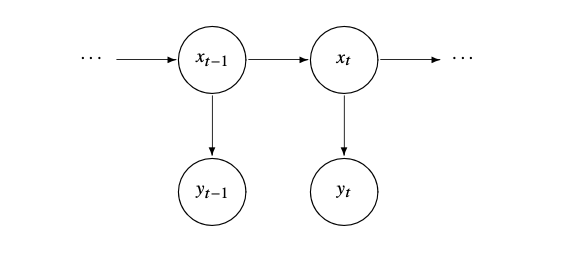

```{r, include=FALSE}
library(forecast)
library(fpp3)
library(tidyverse)
library(tsbox)
library(zoo)
library(seasonal)
library(astsa)
library(patchwork)
library(tseries)
```

```{r setup, include=FALSE}
# Set up chunk for all slides
knitr::opts_chunk$set(
  echo = TRUE,
  message = FALSE,
  warning = FALSE,
  cache = TRUE,
  dev.args = list(pointsize = 11)
)
```

# ---- The Model

## Setup

- The observations $y_t$ depend on the value of an **unobserved** state $x_t$. 

- We want to make inference about $x_t$



## State Space model without covariates

State Equation: p-dimensional 
$$
x_t = \Phi x_{t-1} + w_t
$$

Observation Equation: q-dimensional
$$
y_t = A_t x_t + v_t
$$

## State Space model with covariates

- Assume we have an $r$-dimensional vector of covariates $\{ u_t \}$.

State Equation: p-dimensional 
$$
x_t = \Phi x_{t-1} + \Upsilon u_t + w_t
$$

Observation Equation: q-dimensional
$$
y_t = A_t x_t + \Gamma u_t + v_t
$$

# ---- Some examples

## Global Warming

```{r}
#| output-location: slide
tsplot(
  cbind(gtemp_land, gtemp_ocean),
  spaghetti = TRUE,
  lwd = 2,
  pch = 20,
  type = "o",
  col = astsa.col(c(4, 2), .5),
  ylab = "Temperature Deviations",
  main = "Global Warming"
)
legend(
  "topleft",
  legend = c("Land Surface", "Sea Surface"),
  lty = 1,
  pch = 20,
  col = c(4, 2),
  bg = "white"
)
```

## Global Warming 

- Here we are observing the same signal with different noises

$$
y_{t,1} = x_t + v_{t,1} 
\quad \text{and} \quad
y_{t,2} = x_t + v_{t,2} 
$$

- Hence the observation equation is:

$$
\begin{pmatrix}
y_{t, 1} \\ y_{t, 2}
\end{pmatrix} = 
\begin{pmatrix}
1 \\ 1
\end{pmatrix}
x_t 
+ 
\begin{pmatrix}
v_{t, 1} \\ v_{t, 2}
\end{pmatrix}
$$

## Global Warming

- The State equation:

$$
x_t = \delta + x_{t-1} + w_t
$$

This example has:

- $p = 1$
- $q = 2$
- $\Phi = 1$
- $\Upsilon = \delta$ with $u_t = 1$

## Missing Values

- Suppose we consider the problem of monitoring the level of several biomedical markers after a cancer patient undergoes a bone marrow transplant. 
- measurements made for 91 days on 
  * log(white blood count) [WBC]
  * log(platelet) [PLT]
  * hematocrit [HCT]

- Approximately 40% of the values are missing, with missing values occurring primarily after the 35th day. 

- “Platelet count at about 100 days post transplant has previously been shown to be a good indicator of subsequent long term survival.”

## Missing Values

```{r}
tsplot(blood, type='o', col=c(6,4,2), lwd=2, pch=19, cex=1) 
```

## Missing Values

State Equation:

$$
\begin{pmatrix}
x_{t, 1} \\ x_{t, 2} \\ x_{t, 3}
\end{pmatrix}
= 
\begin{pmatrix}
\phi_{11} & \phi_{12} & \phi_{13} \\
\phi_{21} & \phi_{22} & \phi_{23} \\
\phi_{31} & \phi_{32} & \phi_{33} 
\end{pmatrix}
\begin{pmatrix}
x_{t-1, 1} \\ x_{t-1, 2} \\ x_{t-1, 3}
\end{pmatrix}
+ 
\begin{pmatrix}
w_{t, 1} \\ w_{t, 2} \\ w_{t, 3}
\end{pmatrix}
$$

Observation Equation:

$$
y_t = A_t x_t + v_t
$$

where the $A_t$ matrix is $I$ if day $t$ is observed and $0$ matrix if missing.

# ---- Kalman Filter 

## Some terminology

Consider the problem of trying to predict $x_t$ from 
$y_{1:s} = \{y_1, y_2, \ldots, y_s\}$

- $s < t$ this is **forecasting** or **prediction**

- $s = t$ this is **filtering**

- $s > t$ this is **smoothing**

## The Kalman Filter: the goal

- We want $x_t^t := E(x_t \mid y_{1:t})$, the best estimate of the state using data up
  through time $t$, and its error covariance $P_t^t := \text{Cov}(x_t - x_t^t)$.

- Under the (Gaussian) linear state space model, this conditional expectation *is* the
  minimum mean-squared-error estimator -- no need to restrict to linear predictors,
  it's automatic here.

- Key idea: rather than reprocessing all of $y_1, \ldots, y_t$ from scratch every time
  a new observation arrives, update the *previous* estimate recursively. This is what
  makes the Kalman filter fast and exactly why it is a "filter."

## Initialization

- Start from a prior guess about the state before any data:
$$
x_0^0 = \mu_0, \qquad P_0^0 = \Sigma_0
$$

- Everything that follows is a recursion in $t = 1, \ldots, n$, alternating a
  **prediction** step and an **update** step.

## Step 1: Prediction (time update)

$$
x_t^{t-1} = \Phi\, x_{t-1}^{t-1}
\qquad\qquad
P_t^{t-1} = \Phi\, P_{t-1}^{t-1}\Phi' + Q
$$

- $x_t^{t-1} = E(x_t \mid y_{1:t-1})$: best guess of the state at time $t$ *before*
  seeing $y_t$, obtained just by propagating forward through the state equation.

- $P_t^{t-1}$ grows relative to $P_{t-1}^{t-1}$ by $Q$ -- uncertainty accumulates
  between observations.

## Step 2: The innovation

$$
\epsilon_t = y_t - A_t x_t^{t-1}
\qquad\qquad
\Sigma_t = A_t P_t^{t-1} A_t' + R
$$

- $\epsilon_t$ is the **innovation**: the part of $y_t$ not already predicted from the
  past -- literally the new information the observation brings.

- $\Sigma_t = \text{Cov}(\epsilon_t)$.

- If $\epsilon_t \approx 0$, the prediction was already good and there's little to
  correct.

## Step 3: Update (measurement update)

$$
K_t = P_t^{t-1} A_t' \Sigma_t^{-1}
$$
$$
x_t^{t} = x_t^{t-1} + K_t \epsilon_t
\qquad\qquad
P_t^{t} = (I - K_t A_t)P_t^{t-1}
$$

- $K_t$ is the **Kalman gain**: it converts the innovation into a correction of the
  state estimate.

- Intuition: $K_t$ is large when the prior prediction is very uncertain (large
  $P_t^{t-1}$) relative to the observation noise ($R$) -- trust the new data more --
  and small in the opposite case -- trust the model more.

- Loop back to Step 1 for time $t+1$, using $x_t^t, P_t^t$ as the new starting point.

## Why this matters for estimation

- Under Gaussianity, the innovations $\epsilon_1, \ldots, \epsilon_n$ are independent,
  mean-zero, with covariances $\Sigma_1, \ldots, \Sigma_n$ -- a very convenient
  by-product of the recursion (the **innovations form of the likelihood**).

- This lets us write the Gaussian log-likelihood of the *whole* data set purely in
  terms of quantities the filter already computes, one innovation at a time, instead
  of needing the joint density of $y_{1:n}$ directly.

- This is exactly what `Kfilter(...)$like` returns in `astsa`, and what `optim()`
  minimizes in the MLE examples below -- the Kalman filter is doubling as a
  likelihood evaluator for parameter estimation, not just a state estimator.

## The Kalman Smoother (briefly)

- The filter only conditions on data up to time $t$; the **smoother** conditions on
  *all* $n$ observations:
$$
x_t^n = E(x_t \mid y_{1:n}), \qquad P_t^n = \text{Cov}(x_t - x_t^n)
$$

- Computed by first running the filter forward to the end, then a second recursion
  running *backward* from $t = n$ to $t = 1$ (no proof here, just the idea).

- Since it conditions on more information, the smoother is always at least as precise
  as the filter: $P_t^n \le P_t^t$.

- This is what `Ksmooth()` returns (`Xs`, `Ps`) -- used below alongside `Xp`/`Pp`
  (prediction) and `Xf`/`Pf` (filter).

# ---- Applications

## Local Level Model

Run the Kalman filter and Smoother of $n=50$ simulated observations from this model.

$$
\mu_t = \mu_{t-1} + w_t
$$

with $w_t \sim N(0, 1)$ and $\mu_0 \sim N(0, 1)$.

$$
y_t = \mu_t + v_t
$$

## Local Level Model

```{r}
# generate data 
set.seed(1)  
num = 50
w   = rnorm(num+1,0,1)
v   = rnorm(num,0,1)
mu  = cumsum(w)     # states:  mu[0], mu[1], . . ., mu[50] 
y   = mu[-1] + v    # obs:  y[1], . . ., y[50]
ts_plot(cbind(ts(mu), ts(y)))
```

## Local level model

```{r}
# filter and smooth (Ksmooth does both)
mu0 = 0;  sigma0 = 1;  phi = 1;  sQ = 1;  sR = 1   
ks = Ksmooth(y, A=1, mu0, sigma0, phi, sQ, sR)   
names(ks)
```

- s = smoothed
- p = predicted (forecasted)
- f = filtered


## Local Level Model

```{r}
#| output-location: slide
par(mfrow=c(3,1))

tsplot(mu[-1], type='p', col=4, pch=19, ylab=expression(mu[~t]), main="Prediction", ylim=c(-5,10)) 
  lines(ks$Xp, col=6)
  lines(ks$Xp+2*sqrt(ks$Pp), lty=6, col=6)
  lines(ks$Xp-2*sqrt(ks$Pp), lty=6, col=6)

tsplot(mu[-1], type='p', col=4, pch=19, ylab=expression(mu[~t]), main="Filter", ylim=c(-5,10)) 
  lines(ks$Xf, col=6)
  lines(ks$Xf+2*sqrt(ks$Pf), lty=6, col=6)
  lines(ks$Xf-2*sqrt(ks$Pf), lty=6, col=6)

tsplot(mu[-1], type='p', col=4, pch=19, ylab=expression(mu[~t]), main="Smoother", ylim=c(-5,10)) 
  lines(ks$Xs, col=6)
  lines(ks$Xs+2*sqrt(ks$Ps), lty=6, col=6)
  lines(ks$Xs-2*sqrt(ks$Ps), lty=6, col=6)
```

## MLE on AR(1) with Observational noise

- Parameters are $\phi, \sigma_w, \sigma_v$

- Simulate values with true parameters:
  * $\phi = .8$
  * $\sigma^2_w = \sigma^2_v = 1$
  
  
## MLE on AR(1) with Observational noise

```{r}
set.seed(999)
num = 100
N = num+1
x = sarima.sim(n=N, ar=.8)
y = ts(x[-1] + rnorm(num,0,1))
ts_plot(ts_c(x, y))
```

## MLE on AR(1) with Observational noise

- Seup initial parameter estimates

```{r}
u = ts.intersect(y, stats::lag(y,-1), stats::lag(y,-2)) 
varu = var(u)
coru = cor(u) 
phi = coru[1,3]/coru[1,2] 
q = (1-phi^2)*varu[1,2]/phi 
r = varu[1,1] - q/(1-phi^2) 
(init.par = c(phi, sqrt(q), sqrt(r))) 
```

- Create likelikhood function

```{r}
# Function to evaluate the likelihood 
Linn = function(para) {
  phi = para[1]
  sigw = para[2]
  sigv = para[3]
  Sigma0 = (sigw ^ 2) / (1 - phi ^ 2)
  Sigma0[Sigma0 < 0] = 0
  kf = Kfilter(y, A = 1, mu0 = 0, Sigma0, phi, sigw, sigv)
  return(kf$like)
}
```

## MLE on AR(1) with Observational noise

- Perform estimation with `optim`

```{r}
est = optim(
  init.par,
  Linn,
  method = "BFGS",
  hessian = TRUE
)      
SE = sqrt(diag(solve(est$hessian)))
cbind(estimate=c(phi=est$par[1],sigw=est$par[2],sigv=est$par[3]), SE)
```

## Fit Global Temp model

- Setup $A_t$ and data

```{r}
y = cbind(gtemp_land, gtemp_ocean)
num = nrow(y)
input = rep(1,num)
A = matrix(c(1,1), nrow=2)
mu0 = -.35; Sigma0 = 1;  Phi = 1
```

- Setup likelihood function 

```{r}
Linn=function(para){
  sQ = para[1]      # sigma_w
  sR1 = para[2]    # 11 element of  sR
  sR2 = para[3]    # 22 element of sR
  sR21 = para[4]   # 21 element of sR
 sR = matrix(c(sR1,sR21,0,sR2), 2)  # put the matrix together
 drift = para[5]
 kf = Kfilter(y,A,mu0,Sigma0,Phi,sQ,sR,Ups=drift,Gam=NULL,input)  # NOTE Gamma is set to NULL now (instead of 0)
 return(kf$like) 
}
```

## Fit Global Temp model

- Perform Estimation

```{r}
init.par = c(.1,.1,.1,0,.05)  # initial values of parameters
est = optim(
  init.par,
  Linn,
  method = "BFGS",
  hessian = TRUE
)
SE = sqrt(diag(solve(est$hessian))) 
# Summary of estimation  
estimate = est$par; u = cbind(estimate, SE)
rownames(u)=c("sigw","sR11", "sR22", "sR21", "drift")
u 
```

## Fit Global Temp model - Results

- Rerun Kalman Filter with final parameter estimates

```{r}
# Smooth (first set parameters to their final estimates)
sQ    = est$par[1]  
sR1  = est$par[2]   
sR2  = est$par[3]   
sR21 = est$par[4]  
sR    = matrix(c(sR1,sR21,0,sR2), 2)
(R    = sR%*%t(sR))   #  to view the estimated R matrix
drift = est$par[5]  
ks    = Ksmooth(y,A,mu0,Sigma0,Phi,sQ,sR,Ups=drift,Gam=NULL,input)  # NOTE Gamma is set to NULL now (instead of 0)
```

## Fit Global Temp model - Results

```{r}
#| output-location: slide
tsplot(
  y,
  spag = TRUE,
  margins = .5,
  type = 'o',
  pch = 2:3,
  col = 4:3,
  lty = 6,
  ylab = 'Temperature Deviations'
)
xsm  = ts(as.vector(ks$Xs), start = 1850)
rmse = ts(sqrt(as.vector(ks$Ps)), start = 1850)
lines(xsm, lwd = 2, col = 6)
xx = c(time(xsm), rev(time(xsm)))
yy = c(xsm - 2 * rmse, rev(xsm + 2 * rmse))
polygon(xx, yy, border = NA, col = gray(.6, alpha = .25))
```

# ---- Structural Models

## Overview

- Structural models are component models in which each component may be thought of as explaining a specific type of behavior.

- Models are often some version of the classical time series decomposition of data into **trend**, **seasonal**, and **irregular** components.

- For example, 

$$
y_t = T_t + S_t + v_t
$$

## Trend and seasonal in SSF

- Putting a structural component model in SSF can be seen though an example. 

- Consider Johnson & Johnson quarterly earnings

- We pose the following models for the trend and seasonal components:

$$
T_t = \phi T_{t-1} + w_{t, 1}
$$

$$
S_t + S_{t-1} + S_{t-2} + S_{t-3} = w_{t, 2}
$$

How do we put this in SSF?

## Trend and seasonal in SSF

$$
y_t = T_t + S_t + v_t
$$

Observation Equation:

$$
y_t = 
\begin{pmatrix}
1 & 1 & 0 & 0
\end{pmatrix}
\begin{pmatrix}
T_{t} \\ S_{t} \\ S_{t-1} \\ S_{t-2}
\end{pmatrix}
+ 
\begin{pmatrix}
v_{t, 1} \\ v_{t, 2} \\ 0 \\ 0
\end{pmatrix}
$$

## Trend and seasonal in SSF {.smaller}

State Equation:

$$
\begin{pmatrix}
T_{t} \\ S_{t} \\ S_{t-1} \\ S_{t-2}
\end{pmatrix}
= 
\begin{bmatrix}
\phi & 0 & 0 & 0 \\
0 & -1 & -1 & -1 \\
0 & 1 & 0 & 0 \\
0 & 0 & 1 & 0
\end{bmatrix}
\begin{pmatrix}
T_{t-1} \\ S_{t-1} \\ S_{t-2} \\ S_{t-3}
\end{pmatrix}
+
\begin{pmatrix}
w_{t, 1} \\ w_{t, 2} \\ 0 \\ 0
\end{pmatrix}
$$

where 

$$
Q = 
\begin{pmatrix}
q_{11} & 0 & 0 & 0 \\
0 & q_{22} & 0 & 0 \\
0 & 0 & 0 & 0 \\
0 & 0 & 0 & 0
\end{pmatrix}
$$

## Fit model to JJ series

```{r}
num = length(jj)
A   = cbind(1,1,0,0) 

# Function to Calculate Likelihood 
Linn = function(para){
 Phi = diag(0,4) 
 Phi[1,1] = para[1] 
 Phi[2,]=c(0,-1,-1,-1); Phi[3,]=c(0,1,0,0); Phi[4,]=c(0,0,1,0)
 sQ1 = para[2]; sQ2 = para[3]     # sqrt q11 and sqrt q22
 sQ  = diag(0,4); sQ[1,1]=sQ1; sQ[2,2]=sQ2
 sR = para[4]                     # sqrt r11
 kf = Kfilter(jj, A, mu0, Sigma0, Phi, sQ, sR)
 return(kf$like)  
 }
```

## Fit model to JJ series 

```{r}
# Initial Parameters 
mu0      = c(.7,0,0,0) 
Sigma0   = diag(.04, 4)  
init.par = c(1.03, .1, .1, .5)   # Phi[1,1], the 2 Qs and R

# Estimation
est = optim(
  init.par,
  Linn,
  method = "BFGS",
  hessian = TRUE
)
SE  = sqrt(diag(solve(est$hessian)))
u   = cbind(estimate = est$par, SE)
rownames(u) = c("Phi11", "sigw1", "sigw2", "sigv")
u 
```

## Fit model to JJ series 

```{r}
#| output-location: slide
# Smooth
Phi      = diag(0,4) 
Phi[1,1] = est$par[1]; Phi[2,]  = c(0,-1,-1,-1) 
Phi[3,]  = c(0,1,0,0); Phi[4,]  = c(0,0,1,0)
sQ       = diag(0,4)
sQ[1,1]  = est$par[2]
sQ[2,2]  = est$par[3]   
sR       = est$par[4]   
ks       = Ksmooth(jj, A, mu0, Sigma0, Phi, sQ, sR)   

# Plots
Tsm   = ts(ks$Xs[1,,], start=1960, freq=4)
Ssm   = ts(ks$Xs[2,,], start=1960, freq=4)
p1    = 3*sqrt(ks$Ps[1,1,]); p2 = 3*sqrt(ks$Ps[2,2,])
par(mfrow=c(2,1))
tsplot(Tsm, main='Trend Component', ylab='Trend')
  xx  = c(time(jj), rev(time(jj)))
  yy  = c(Tsm-p1, rev(Tsm+p1))
polygon(xx, yy, border=NA, col=gray(.5, alpha = .3))
tsplot(jj, main='Data & Trend+Season', ylab='J&J QE/Share', ylim=c(-.5,17))
  xx  = c(time(jj), rev(time(jj)) )
  yy  = c((Tsm+Ssm)-(p1+p2), rev((Tsm+Ssm)+(p1+p2)) )
polygon(xx, yy, border=NA, col=gray(.5, alpha = .3))
```

## Forecast JJ series 

```{r}
#| output-location: slide
# Forecast
n.ahead = 12
y       = ts(append(jj, rep(0,n.ahead)), start=1960, freq=4)
rmspe   = rep(0,n.ahead) 
x00     = ks$Xf[,,num]
P00     = ks$Pf[,,num]
Q       = sQ%*%t(sQ) 
R       = sR%*%t(sR)
for (m in 1:n.ahead){
       xp = Phi%*%x00
       Pp = Phi%*%P00%*%t(Phi)+Q
      sig = A%*%Pp%*%t(A)+R
        K = Pp%*%t(A)%*%(1/sig)
      x00 = xp 
      P00 = Pp-K%*%A%*%Pp
 y[num+m] = A%*%xp
 rmspe[m] = sqrt(sig) 
}
tsplot(y, type='o', main='', ylab='J&J QE/Share', ylim=c(5,30), xlim = c(1975,1984))
upp  = ts(y[(num+1):(num+n.ahead)]+2*rmspe, start=1981, freq=4)
low  = ts(y[(num+1):(num+n.ahead)]-2*rmspe, start=1981, freq=4)
 xx  = c(time(low), rev(time(upp)))
 yy  = c(low, rev(upp))
polygon(xx, yy, border=8, col=gray(.5, alpha = .3))
abline(v=1981, lty=3)
```
